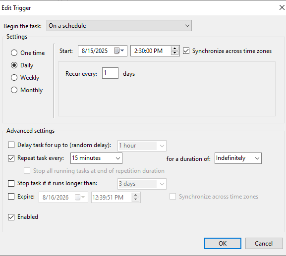

# 🧠 Windows Server 2022 Megalab Project

Simulated a full enterprise environment with Active Directory, user/group provisioning, NTFS permissions, Group Policy, and PowerShell-based log analysis tools. This project showcases practical cybersecurity and systems administration skills.

## ✅ Key Skills Demonstrated

-   **Active Directory Management:** User and group provisioning, Organizational Unit (OU) design.
-   **NTFS Permission Control:** Implementing granular folder access permissions.
-   **Group Policy Objects (GPO):** Configuring and enforcing security policies (e.g., UI lockdowns, drive mapping).
-   **PowerShell Scripting:** Advanced log parsing, data extraction, and CSV export.
-   **Security Information & Event Management (SIEM) Lite:** Real-time login failure monitoring (Event ID 4625) and threat IP extraction using PowerShell.

---

## 👨‍💻 Phase 1: Active Directory Design & Management

Designed and implemented a logical Active Directory structure for `ajx.local`, including custom Organizational Units (OUs) for department-specific user and group management. User accounts were provisioned across these OUs, and security groups were created (e.g., `AJX_Staff`, `Finance_Staff`) to facilitate streamlined access control and policy application.

*Visual representation of the custom OU structure within Active Directory Users and Computers.*

*Demonstrates a user account's membership in relevant security groups, crucial for permissions and GPO targeting.*

---

## 📂 Phase 2: File System Security & Group Policy Enforcement

Configured robust file system security using NTFS permissions and enforced security best practices across the domain through Group Policy Objects (GPOs).

### NTFS Permissions

Granular NTFS permissions were applied to shared network drives, ensuring that only authorized security groups (e.g., `AJX_Staff`) had appropriate access levels (e.g., Modify) to sensitive data.

.png)
*Screenshot of the NTFS security tab, showing explicit permissions granted to a custom security group on a shared folder.*

### Group Policy Object (GPO) Lockdowns

Implemented restrictive GPOs to enhance endpoint security for standard users, preventing access to critical system tools.

*Displays the configured GPO settings in the Group Policy Management Editor, including policies to disable Control Panel, Command Prompt, and Task Manager.*

*Validation of GPO enforcement: A standard user's attempt to access Task Manager is successfully blocked by the applied Group Policy.*

### GPO Drive Mapping

Automated network drive mapping for users based on their Active Directory group membership, providing consistent access to shared resources.

*File Explorer view from a standard user's session, confirming the successful automatic mapping of a network drive (Z:).*

---

## 🔐 Phase 3: PowerShell Log Analysis & SIEM Simulation

Developed PowerShell scripts to perform real-time security monitoring, focusing on failed login attempts (Event ID 4625), and to extract and export critical security event data.

### Real-time Login Monitoring Dashboard

A continuous PowerShell script simulates a Security Information and Event Management (SIEM) dashboard, providing a live, console-based view of failed login attempts, including timestamps, usernames, and source IP addresses.

*Screenshot of the PowerShell console displaying the dynamic, real-time failed login event dashboard.*

### Log Parsing and Data Export

Utilized `Get-WinEvent` with advanced filtering and regex to efficiently parse Windows Security event logs for Event ID 4625 (failed logons). Extracted key details were then structured and exported to CSV files for audit, further analysis, and long-term storage.

*Demonstrates the raw output from a targeted `Get-WinEvent` query, highlighting the ability to filter and retrieve specific security events.*

*Content of an exported CSV file, showing structured failed login data (TimeCreated, IPAddress), ready for auditing.*

All generated log data (CSV files) is stored in a dedicated, shared directory on the domain controller, accessible for centralized security analysis.

*File Explorer view of the designated `C:\AJXShared\Logs` directory, confirming the presence of generated audit CSV files.*

---

# Automated Failed Logon Monitoring with PowerShell and Task Scheduler

This project demonstrates a simple yet effective method for automated security log analysis on a Windows Server. Using a PowerShell script and Windows Task Scheduler, the solution continuously monitors for failed login attempts (Event ID 4625), extracts key information, and exports the data to a structured CSV file for auditing and analysis.

---

## 🚀 Project Overview

The goal of this project was to create a hands-off, operational system for tracking failed login attempts on a Windows machine. This "SIEM-lite" approach combines scripting and system automation to transform raw security events into actionable, persistent data.

The project is broken down into three main components:
* **Scripting:** A PowerShell script (`FailedLogins.ps1`) to query and parse the Windows Security Event Log.
* **Automation:** Windows Task Scheduler to run the script at regular intervals.
* **Data Management:** Centralized storage of output logs in a dedicated directory.

---

## ⚙️ How It Works

### 1. Script Development

The core of the project is the `FailedLogins.ps1` script, which automates the process of querying the Security Event Log.

*The image shows the source code of the `FailedLogins.ps1` PowerShell script. It demonstrates the use of `Get-WinEvent` to filter for **Event ID 4625**, the use of `ForEach-Object` to iterate through the events, and the creation of a `PSCustomObject` to structure the output data. The script extracts specific properties, such as `TimeCreated`, `UserName`, and `IPAddress`, and then pipes the results to `Export-Csv`, ensuring the output is a clean, structured CSV file.*

The script was placed in its own dedicated folder to ensure clean organization.

*The image shows that the `FailedLogins.ps1` is located under `C:\Scripts`, separating it from the log output directory.*

### 2. Event Log Validation and Testing

Before building the full automation, I validated that failed login events are correctly logged by the system and contain the necessary data. I generated test events by intentionally entering a wrong password.

*These images show a simulated failed login attempt using either the `runas` command or `Start-Process` with a deliberately incorrect password. This action generates the failed logon event (**Event ID 4625**) in the Security event log, which the main script is designed to detect and log.*

I then confirmed that the events were correctly recorded in the Windows Event Log using PowerShell.

*These images display the output of the `Get-WinEvent` PowerShell command, confirming that failed login attempts are being successfully recorded in the Windows Event Log with the correct Event ID. They also show a detailed view of a single failed login event, confirming the event contains all the necessary information, such as username and IP address, that the script needs to parse.*

---

## 🏃 Automation & End-to-End Functionality

To make the solution truly automated, I used Windows Task Scheduler to run the PowerShell script every 15 minutes. This transforms a one-time script into a continuous monitoring system.

*These images show the main view of the Windows Task Scheduler and the "Edit Trigger" window for the "AJX Failed Logins" task. The trigger is configured to repeat the task every 15 minutes indefinitely, providing a near-real-time monitoring system.*

The final end-to-end functionality was confirmed by simultaneously viewing the Task Scheduler and the log file.

*This composite screenshot serves as proof of the full end-to-end automation process. It simultaneously shows the Windows Task Scheduler, with the "AJX Failed Logins" task running successfully, and a Notepad window displaying the populated `FailedLogins.csv` file. This demonstrates that the scheduler is successfully executing the PowerShell script, and the script is, in turn, successfully writing the failed login data to the CSV file.*

---

## 📁 Log Management & Output

All log files generated by the script are stored in a centralized, dedicated directory (`C:\AJXShared\Logs`). This is a key best practice for log management, as it makes data easy to access for analysis and auditing.

*This image shows a Windows Explorer view of `C:\AJXShared\Logs`, confirming the presence of the log files. Storing these logs in a single, dedicated folder is a key principle of security information and event management (SIEM).*

The final output is a persistent, structured CSV file (`FailedLogins.csv`), which serves as an auditable record of all failed login attempts. This data can be easily imported into other tools for further analysis.

*This image displays a PowerShell console showing the output of a command to import and display the last five entries from the CSV file. This proves the PowerShell script is correctly exporting data into a structured CSV format, with a complete history of failed authentications.*

---

## ✅ Skills Demonstrated

This project showcases a practical application of several valuable skills:

* **Scripting:** Developed a custom PowerShell script to solve a specific security problem.
* **Automation:** Used native system tools (**Task Scheduler**) to automate a process.
* **Problem-Solving:** Created an end-to-end solution from event generation to data output.
* **Security Principles:** Applied core concepts of log analysis and centralized log management.
